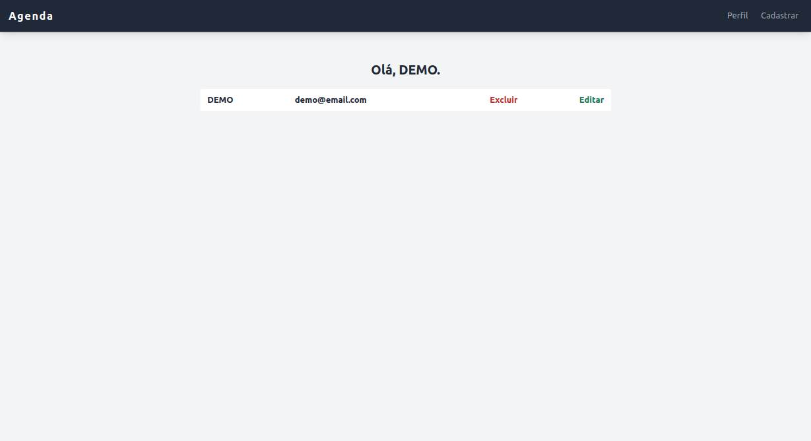

# Agenda




---

## 🔖 Tabela de Conteúdo

- [📕 Sobre](#📕-sobre)
- [⚒️ Tecnologias Utilizadas](#⚒️-tecnologias-utilizadas)
- [✨ Features](#✨-features)
- [⚙️ Como Utilizar](#⚙️-como-utilizar)
- [🧑‍🎓 O que Aprendi](#🧑‍🎓-o-que-aprendi)
- [🤝 Seja um Contribuidor](#🤝-seja-um-contribuidor)
- [🔓 Licença](#🔓-licença)

---

## 📕 Sobre

Esta aplicação é uma simples e intuitiva agenda de contatos, possibilitando CRUD dos contatos. Além disso, a aplicação também conta com um sistema de autenticação por meio de sessions, permitindo assim a criação de usuários e o login.

---

## ⚒️ Tecnologias Utilizadas

Para desenvolver esta aplicação, utilizei as seguintes tecnologias:

- HTML5
- CSS3
- Javascript
- Express
- TailwindCSS+PostCSS
- Webpack

---

## ✨ Features

- Responsividade
- CRUD de contatos
- Autenticação de usuários por meio de sessões

---

## ⚙️ Como Utilizar

Primeiro, clone o projeto em sua máquina. Logo que abrir a pasta, verá um arquivo nomeado .env.example, que contém todas as variáveis de ambiente necessárias para rodar o projeto. Crie seu arquivo .env e atribua manualmente valores para as variáveis.

Feito isto, instale todas as dependências do projeto:

```
yarn install
```

Em seguida, inicie o server no localhost:

```
yarn start
```

Caso precise alterar algo no CSS, certifique-se de que o NODE_ENV está como development e rode o comando `yarn css`, assim o arquivo styles.css conterá todos os estilos proporcionados pelo TailwindCSS. Quando terminar as alterações, mude o NODE_ENV para production, e rode `yarn css` novamente.

O mesmo serve para alguma alteração nos arquivos javascript estáticos. Contudo, você deve usar `yarn js` para gerar o resultado final pelo webpack.

---

## 🧑‍🎓 O que Aprendi

O projeto é um "upgrade" de um outro projeto de agenda, com o nome contact-book. Contudo, este primeiro utilizava SQLite para a base de dados. Então, depois de aprender mais algumas coisas e experimentar outras tecnologias, como o MongoDB, resolvi criar este.

O layout é bem simples, não queria dedicar tanto tempo nisso, e sim nas funcionalidades. Mesmo assim, optei por usar o TailwindCSS, por ser uma ferramenta que nunca havia utilizado antes, e já queria dar uma chance há um bom tempo. Junto a ele, aprendi a utilizar o PostCSS, visto que as duas ferramentas se complementam perfeitamente, abrindo também um universo de possibilidades em forma de plugins. O processo de aprendizado foi bem divertido, pude ver na prática a robustez da filosofia utility-first do Tailwind, somada ao poder dos plugins do PostCSS, gerando um CSS final otimizado e leve.

Quanto à base de dados, minha escolha foi o MongoDB. Já havia experimentado o SQLite antes, e estava afim de conhecer um pouco mais sobre o outro lado da moeda, isto é, NoSQL. Pelo fato das databases Mongo utilizarem documentos estruturados como JSON, a assimilação foi muito suave e rápida. Além disso, a facilidade e praticidade do driver para NodeJS deu um bom incentivo na produtividade, com comandos simples e diretos, para gerenciar a base de dados na nuvem.

Contudo, o que mais me deixou animado para este projeto foi implementar o sistema de login e cadastro de usuários, uma vez que nunca fiz algo parecido. Para tal, utilizei o express-session, para gerenciar as sessões, e o MongoStore, para utilizar a base de dados Mongo já existente. O sistema ficou bem simples, e me proporcionou clareza prática de como implementar autenticação, por mais simples que seja o projeto.

No mais, o projeto foi uma ótima oportunidade de experimentar tecnologias novas, e me trouxe novos conhecimentos muito úteis, além do divertido processo de aprendizagem que cada ferramente trouxe consigo.

---

## 🤝 Seja um Contribuidor

Tem alguma ideia que poderia alavancar ainda mais o projeto, e deseja implementar? É simples!

1. Faça fork do proketo
2. Modifique o que achar necessário
3. Faça o commit das mudanças
4. Crie um Pull Request

---

## 🔓 Licença

Este projeto está sob licença MIT. Clique [aqui](./LICENSE) para mais detalhes.
